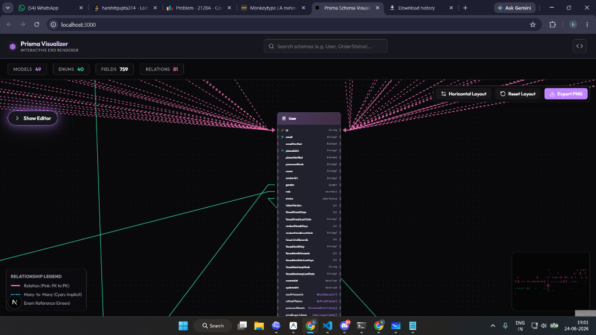
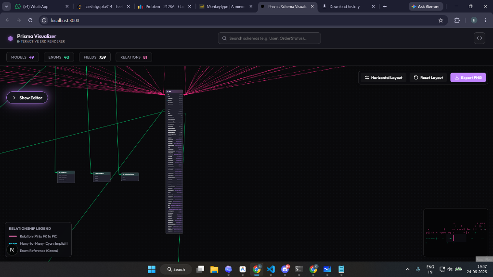
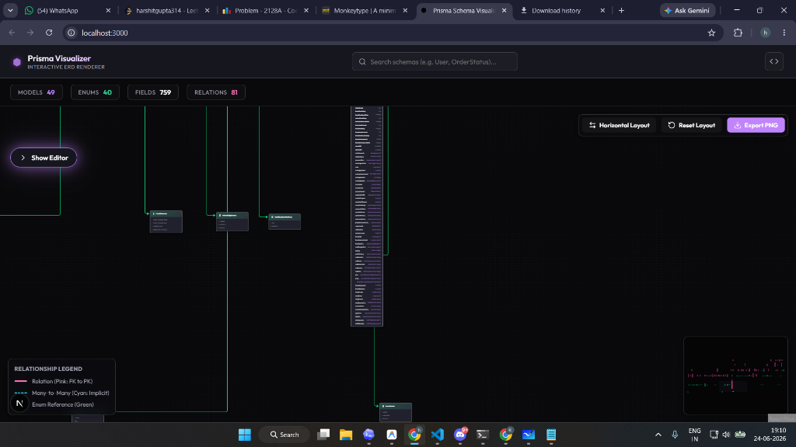

# Prisma Schema Visualizer

A high-performance, interactive, premium dark-themed Entity-Relationship Diagram (ERD) visualizer for Prisma Schemas. Designed to handle large schemas with hundreds of models smoothly at 60fps.

---

## 🌟 Why is it useful?

Visualizing database schemas can get cluttered, slow, and hard to read. This visualizer solves these issues with advanced routing, rendering optimizations, and custom aesthetics:

### 1. Collision-Free Routing (Zero Overlapping Wires)
Parallel wires running in the same column channel are grouped and dynamically assigned to separate lanes (spaced 12px apart). This mathematically guarantees **zero line overlaps**, ensuring every relationship path is distinct and visible.

### 2. Smart Obstacle Avoidance
All connections route strictly outside card boundaries. A multi-corridor rank gap scanner analyzes node positions and routes horizontal/diagonal crossings through empty corridors. Wires will **never cross behind or underneath database cards**.

### 3. Angled Intersections
When lines cross, they intersect at a steep diagonal angle rather than a straight 90° crosshair. This allows you to instantly trace the path of each line without confusing it with intersecting wires.

### 4. Zero-Lag Viewport Zoom & Pan (60 FPS)
- **Vector-Effect Styling**: Lines use GPU-accelerated `non-scaling-stroke`, keeping them sharp and thick at any distance without CPU re-renders.
- **0% Idle CPU Load**: Gliding arrows only render and animate on hovered/selected lines. When the screen is idle, animation ticks drop to zero.
- **Filter-Free Neon Glows**: Replaced heavy SVG drop-shadow blur filters with zero-overhead dual-path rendering (a thick semi-transparent glow path behind a thin core path) for hardware-accelerated drawing.

### 5. High Zoom-Out Visibility
- Cards are styled with thick borders and soft glowing halos (Pink for Models, Green for Enums) to remain highly distinct when zoomed out.
- Zoom range extends from **0.02x to 5.0x**.

### 6. Crash-Free PNG Export
The diagram exporter uses optimized font-embedding bypass configurations, preventing memory leaks and tab crashes when downloading diagrams of massive schemas.

---

## 📸 Screenshots

### Spaced & Merged Channels
Parallel wires are offset in vertical channels but merge cleanly 35px before entering handles, preventing arrowhead clutter.

### High Contrast Focus States
Hovering or selecting elements dims the rest of the canvas and lights up connected nodes and relationships.

---

## 🚀 How to Use it

### 1. Paste Schema
Paste your `schema.prisma` file directly inside the Monaco editor on the left. The visualizer compiles the schema on-the-fly.

### 2. Navigate and Zoom
- **Pan**: Click and drag on the canvas background.
- **Zoom**: Scroll your mouse wheel or pinch-to-zoom (range: `0.02x` to `5.0x`).

### 3. Interact
- **Drag Nodes**: Left-click and drag any model/enum card header to reposition it. Connected wires will dynamically re-route around other boxes.
- **Focus Path**: Hover or click on any relationship line or table card. Unrelated items will dim, and the active path will glow. Clicking a line highlights the entire merged wire group.
- **Layout Direction**: Use the top-right controls to toggle between Vertical (`TB`) and Horizontal (`LR`) layouts.

### 4. Export PNG
Click the **Export PNG** button in the top-right panel to download the diagram instantly.
